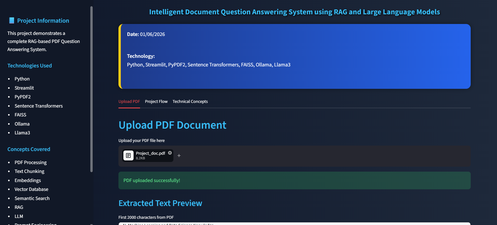
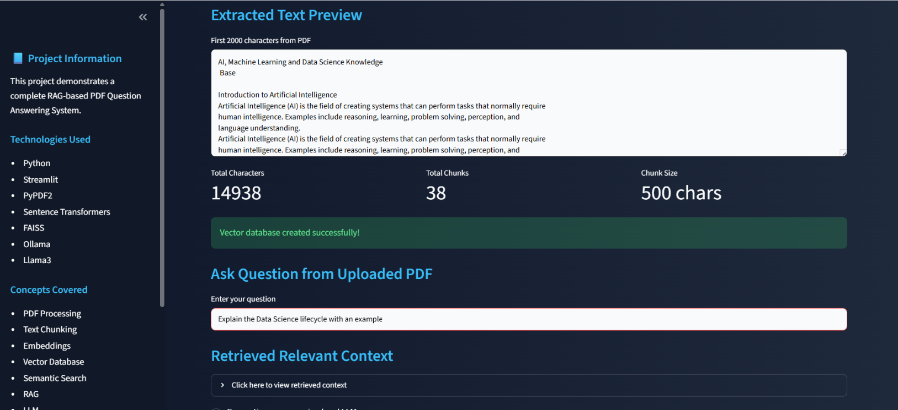
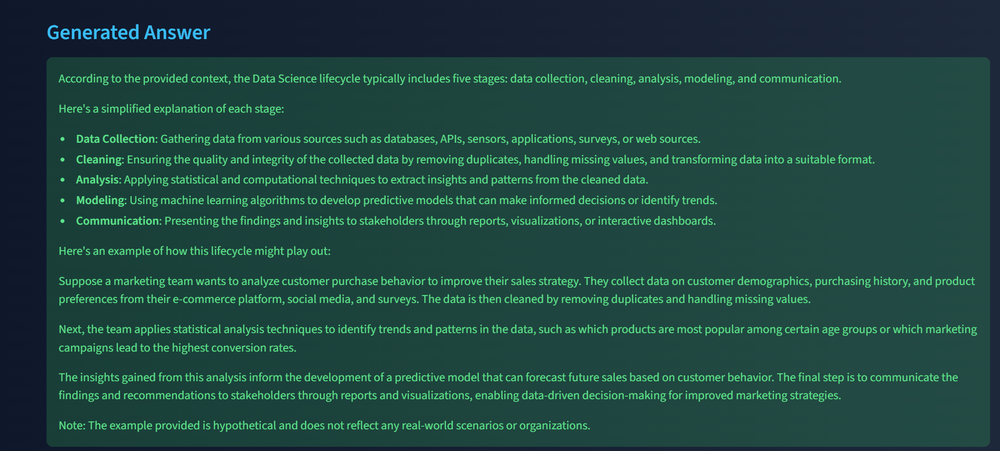
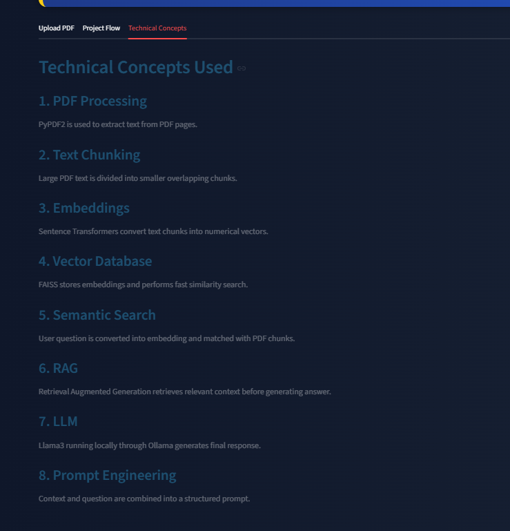
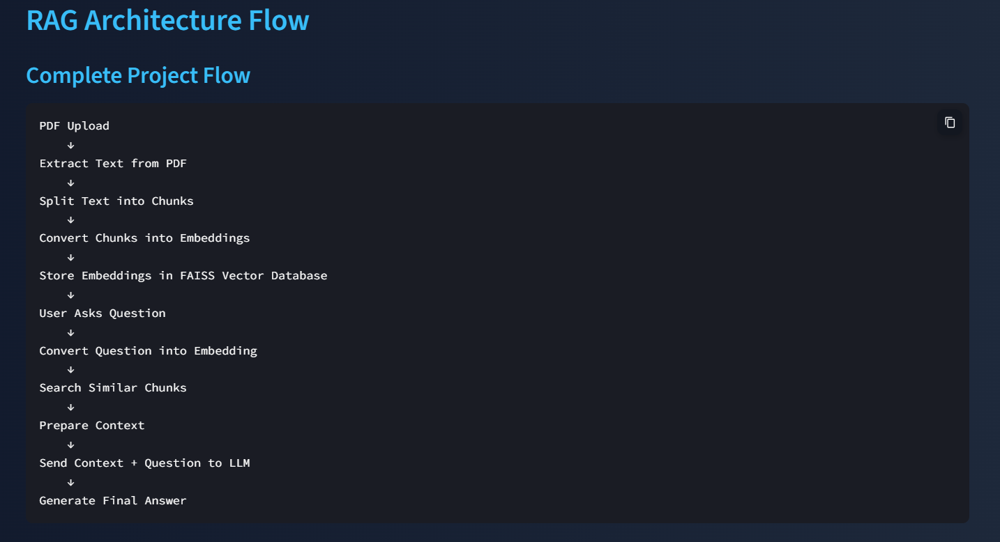

<div align="center">

# 📄 Intelligent Document Question Answering System using RAG and Large Language Models

### A Streamlit-based Retrieval-Augmented Generation (RAG) application for asking natural language questions from uploaded PDF documents


</div>

---

## 📌 Table of Contents

- [🚀 Overview](#-overview)
- [✨ Features](#-features)
- [🛠️ Tech Stack](#️-tech-stack)
- [🧠 Core Concepts Covered](#-core-concepts-covered)
- [⚙️ How It Works](#️-how-it-works)
- [🔄 Project Workflow](#-project-workflow)
- [🏗️ RAG Architecture](#️-rag-architecture)
- [📸 Screenshots](#-screenshots)
- [📚 Learning Outcomes](#-learning-outcomes)
- [🔮 Future Improvements](#-future-improvements)
- [📂 Project Structure](#-project-structure)
- [⚡ Installation](#-installation)
- [🤖 Run Ollama](#-run-ollama)
- [▶️ Run the Application](#️-run-the-application)
- [📌 Example Use Cases](#-example-use-cases)
- [🙌 Conclusion](#-conclusion)

---

## 🚀 Overview

The **Intelligent Document Question Answering System** is a **Retrieval-Augmented Generation (RAG)** based application that allows users to upload **PDF documents** and ask questions in **natural language**.

The system extracts text from uploaded PDFs, splits the content into meaningful chunks, converts those chunks into **vector embeddings**, stores them inside a **FAISS vector database**, retrieves the most relevant context for a given question, and then uses **Llama 3 via Ollama** to generate context-aware answers.

This project demonstrates how **RAG, semantic search, embeddings, vector databases, and large language models** can be combined to build an interactive **document-based question answering system**.

---

## ✨ Features

- 📂 Upload PDF documents through an interactive **Streamlit** interface
- 📄 Extract and preview text from uploaded PDF files
- ✂️ Split large document text into smaller chunks
- 🔎 Generate embeddings for each chunk using **Sentence Transformers**
- 🗂️ Store embeddings inside a **FAISS vector database**
- 🧠 Perform **semantic similarity search** to retrieve relevant context
- 💬 Ask questions from the uploaded document in natural language
- 🤖 Generate context-aware answers using **Llama 3 via Ollama**
- 📊 View chunking statistics such as total characters, total chunks, and chunk size
- 🧩 Explore project workflow and technical concepts directly inside the application

---

## 🛠️ Tech Stack

<div align="center">

<table>
<tr>
<td align="center"><br><b>Python</b></td>
<td align="center"><br><b>Streamlit</b></td>
<td align="center"><br><b>FAISS</b></td>
<td align="center"><br><b>Sentence Transformers</b></td>
</tr>
<tr>
<td align="center"><br><b>Ollama</b></td>
<td align="center"><br><b>Llama 3</b></td>
<td align="center"><br><b>RAG Pipeline</b></td>
<td align="center"><br><b>PDF QA</b></td>
</tr>
</table>

</div>

---

## 🧠 Core Concepts Covered

This project helped in understanding and implementing:

- **Retrieval-Augmented Generation (RAG)**
- **PDF Text Extraction**
- **Text Chunking**
- **Embeddings**
- **Vector Databases**
- **Semantic Search**
- **Large Language Models (LLMs)**
- **Prompt Engineering**
- **Document-based Question Answering**
- **Interactive AI Web Application Development**

---

## ⚙️ How It Works

The application follows the workflow below:

1. **Upload PDF Document**  
   The user uploads a PDF file through the Streamlit interface.

2. **Text Extraction**  
   The system extracts text content from the uploaded PDF using **PyPDF2**.

3. **Text Chunking**  
   The extracted text is divided into smaller chunks for efficient retrieval.

4. **Embedding Generation**  
   Each chunk is converted into vector embeddings using **Sentence Transformers**.

5. **Vector Database Creation**  
   The generated embeddings are stored inside a **FAISS vector database**.

6. **User Query Processing**  
   When the user asks a question, the question is also converted into an embedding.

7. **Semantic Retrieval**  
   The FAISS vector store retrieves the most relevant chunks based on similarity search.

8. **Context + Question to LLM**  
   The retrieved context is combined with the user question and sent to **Llama 3** via **Ollama**.

9. **Answer Generation**  
   The LLM generates a final context-aware answer based on the retrieved document content.

---

## 🔄 Project Workflow

```text
PDF Upload
   ↓
Extract Text from PDF
   ↓
Split Text into Chunks
   ↓
Generate Embeddings
   ↓
Store Embeddings in FAISS
   ↓
User Asks Question
   ↓
Convert Question into Embedding
   ↓
Retrieve Relevant Chunks
   ↓
Send Context + Question to LLM
   ↓
Generate Final Answer
```

---

## 🏗️ RAG Architecture

### End-to-End Flow

```text
User Uploads PDF
        ↓
PDF Text Extraction
        ↓
Chunking of Text
        ↓
Generate Embeddings
        ↓
Store in FAISS Vector Database
        ↓
User Question
        ↓
Convert Question to Embedding
        ↓
Retrieve Relevant Chunks
        ↓
Combine Context + User Query
        ↓
Send to Llama 3 via Ollama
        ↓
Generate Final Answer
```

### Architecture Summary
- **Document Input Layer** → PDF upload and text extraction  
- **Preprocessing Layer** → cleaning and chunking extracted content  
- **Embedding Layer** → convert chunks into vector embeddings  
- **Retrieval Layer** → store and search vectors using **FAISS**  
- **Generation Layer** → pass retrieved context to **Llama 3**  
- **Output Layer** → display final answer in Streamlit interface  

---

## 📸 Screenshots

### 🖼️ Application Demo Gallery

<p align="center">
  
</p>

<p align="center"><b>Upload PDF Document Interface</b></p>

<p align="center">
  
</p>

<p align="center"><b>Extracted Text Preview and Chunk Statistics</b></p>

<p align="center">
  
</p>

<p align="center"><b>Generated Answer using Retrieved Context</b></p>

<p align="center">
  
</p>

<p align="center"><b>Technical Concepts Used in the Project</b></p>

<p align="center">
  
</p>

<p align="center"><b>Complete RAG Architecture Flow</b></p>
---

## 📚 Learning Outcomes

Through this project, I gained practical understanding of:

- Building an **end-to-end RAG pipeline**
- Performing **semantic search on PDF content**
- Creating and using **vector embeddings**
- Working with **FAISS vector databases**
- Integrating **Llama 3 with Ollama**
- Designing **document question answering systems**
- Building interactive AI applications using **Streamlit**

---

## 🔮 Future Improvements

Some possible future enhancements for this project are:

- Support for **multiple PDF documents**
- Add **chat history / conversational memory**
- Display **source citations** for generated answers
- Improve chunking using advanced chunking strategies
- Add **document summarization**
- Enable **multi-document retrieval**
- Deploy the application on cloud platforms
- Improve UI/UX for a more chatbot-like experience


---

## ⚡ Installation

Clone the repository and install the required dependencies:

```bash
git clone https://github.com/siddhik15/Intelligent-Document-Question-Answering-System-using-RAG-and-Large-Language-Models-.git
cd Intelligent-Document-Question-Answering-System-using-RAG-and-Large-Language-Models-
pip install -r requirements.txt
```

---

## 🤖 Run Ollama

Make sure **Ollama** is installed and the **Llama 3** model is available locally.

```bash
ollama run llama3
```

---

## ▶️ Run the Application

```bash
streamlit run Intelligent_Document_Question_Answering_System.py
```

---

## 📌 Example Use Cases

This system can be used for:

- 📘 Question answering from **study material / notes**
- 📄 Extracting insights from **research papers**
- 🧾 Asking questions from **technical documentation**
- 📊 Understanding content from **reports and PDFs**
- 🤖 Building AI-powered **document assistants**

---

## 🙌 Conclusion

The **Intelligent Document Question Answering System using RAG and Large Language Models** demonstrates how modern AI techniques such as **RAG, semantic search, embeddings, vector databases, and LLMs** can be integrated to build a practical and interactive document assistant.

This project strengthened my understanding of **LLM-powered applications, retrieval pipelines, and AI-based knowledge systems**, while also improving my hands-on experience with **Streamlit, FAISS, Ollama, and Llama 3**.

---

## 👩‍💻 Author

**Siddhi Kakade**  
Computer Engineering Student | AI/ML & Data Science Enthusiast

If you found this project interesting, feel free to ⭐ the repository.
